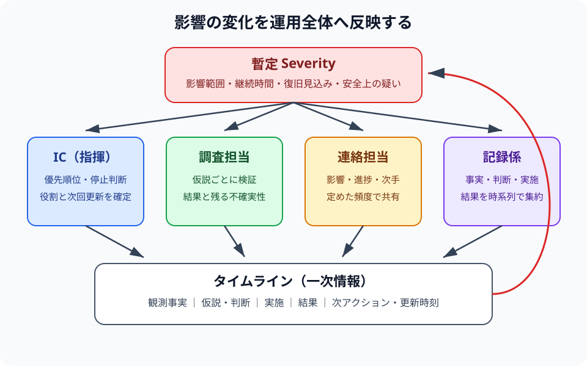

# 第5章：インシデント運用（Severity/役割/タイムライン）

## この章で学ぶこと

- Severity（影響度）で対応の優先順位を決める
- 役割（IC 等）を明確にし、意思決定を速くする
- タイムライン運用で状況を共有する
- NIST SP 800-61 Rev. 3 の CSF 2.0 対応を踏まえて、準備・検知・対応・復旧・教訓化を接続する

## 成果物（または判断基準）

- インシデント記録（付録: [インシデント記録](../../appendices/templates/incident-log/)）
- タイムライン（付録: [タイムライン](../../appendices/templates/timeline/)）

## 本文

運用が不十分だと、技術対応が適切でも復旧が遅延する。役割と共有頻度をあらかじめ定める。

注: IC は調査に入り過ぎず、意思決定と調整（優先順位/共有/エスカレーション）に専念する。

### 最小の役割

- IC（指揮）: 優先順位と判断
- 調査担当: 原因候補の検証
- 連絡担当: 関係者への共有
- 記録係: タイムライン、判断理由、実施内容の記録

Severity は“誰にどの程度影響しているか”を軸に判断する。
Severity（P0/P1/P2/P3）の最小定義は、付録の[チェックリスト集](../../appendices/checklists/)を参照。
判断に迷う場合は、付録の[これはインシデントか？](../../appendices/templates/is-incident/)を使い、暫定 Severity で扱う。

### Severity を見直すタイミング

Severity は一度決めたら固定ではない。次の条件で上げ下げを見直す。

| 見直し条件 | 確認すること |
| --- | --- |
| 影響拡大 | 対象ユーザー、失敗率、売上/業務影響、地域、継続時間 |
| セキュリティ/プライバシー疑い | 不正アクセス、権限逸脱、秘密情報/個人情報、外部共有の有無 |
| 復旧見込みの変化 | 暫定策の効果、ロールバック可否、代替手段 |
| 外部連絡の必要性 | 顧客、委託元、法務/プライバシー窓口、規制・契約上の通知判断 |

判断に迷う場合は、低く見積もるより暫定的に高めに扱い、次回更新時に根拠付きで見直す。

### Severity の分類例（最小）

| 事象（例） | 影響（例） | 暫定 Severity（例） | 初動（例） |
| --- | --- | --- | --- |
| ログイン不可 | ほぼ全ユーザー | P0 | 直ちに対応、関係者招集、更新頻度を上げる |
| 決済 API の 5xx 増加 | 一部顧客、失敗率 6% | P1 | 優先対応、迂回策/ロールバック判断、状況共有を固定 |
| 管理画面の不具合 | 運用担当のみ、回避策あり | P2 | 予定化、恒久対策の計画 |
| 表示崩れ | 影響が軽微 | P3 | バックログ化して定期見直し |

### タイムラインの最小テンプレ（抜粋）

| 時刻（タイムゾーン付き推奨） | 観測事実/事象 | 仮説/判断 | 実施 | 結果/次アクション |
| --- | --- | --- | --- | --- |
| 2026-02-24T10:12:00+09:00 | 検知 | 暫定 P1 | IC 任命 | 次回更新 10:27 JST |

<figure class="book-figure" id="figure-ch05-severity-roles-timeline">
  
  <figcaption>図5-1: Severity、役割分担、タイムラインを連動させる運用ループ</figcaption>
</figure>
<p class="figure-text-alternative">影響範囲と継続時間からSeverityを暫定判断し、ICが優先順位を決める。調査担当は仮説を検証し、連絡担当は定めた頻度で状況を共有し、記録係は観測事実・判断・実施・結果をタイムラインへ集約する。新しい影響や復旧見込みの変化があればSeverityと役割、次回更新時刻を見直し、同じループを継続する。</p>

### NIST SP 800-61 Rev. 3 との対応（概要）

NIST SP 800-61 Rev. 3 は、従来のフェーズ説明だけでなく、NIST CSF 2.0 の Govern / Identify / Protect / Detect / Respond / Recover に沿ってインシデント対応をリスク管理全体へ組み込む考え方を示している。本書では初学者向けに手順順の章立てを保ちつつ、次の対応関係で運用する。

| CSF 2.0 での位置づけ（要約） | 本書の対応 | 主に使うテンプレ |
| --- | --- | --- |
| Govern / Identify / Protect | 役割、Severity、記録、権限、証跡保全、訓練の準備 | チェックリスト集、インシデント記録 |
| Detect | 第1〜3章（症状、影響、証跡、ログ/メトリクス/トレース） | インシデント記録、タイムライン |
| Respond | 第4〜6章（切り分け、優先順位、連絡、エスカレーション） | 状況共有、エスカレーション、タイムライン |
| Recover | 第7章（復旧、ロールバック、復旧完了条件） | 状況共有、タイムライン |
| 教訓反映（Govern / Identify / Protect へのフィードバック） | 第8章（ポストモーテム、再発防止、Runbook/検知改善） | ポストモーテム、フォローアップ Issue |

従来の Preparation / Detection & Analysis / Containment, Eradication & Recovery / Post-Incident Activity という流れは説明には有用だが、Rev. 3 では CSF 2.0 に沿って平時の準備、検知、対応、復旧、教訓化を継続的に接続する点を重視する。

## 具体例（場当たり→再現性）

### 悪い例（場当たり）

```md
全員が同時に調査し、連絡がない
誰が判断するか不明
タイムラインがない
```

### 良い例（再現性）

```md
IC を置き、調査/連絡を分担
Severity: 影響 8%（例）→高（復旧優先）
タイムラインを更新し、関係者に 15 分ごと共有
```

## チェックリスト

- [ ] IC 等の役割が決まっている
- [ ] Severity と見直し条件が説明できる
- [ ] タイムラインが更新されている

## まとめ

- Severity により優先度と共有頻度（更新サイクル）を決め、影響やセキュリティ疑いに応じて見直す
- IC/調査/連絡など最小役割を割り当て、意思決定経路を固定する
- インシデント記録とタイムラインを一次情報として運用する

## 次章への接続

- 次章: [第6章](../chapter-06/)
